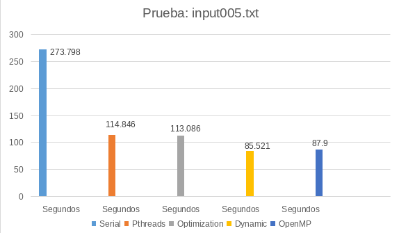

 
# Tarea 03: zippass_optimized

## CI-0117 Programación Paralela y Concurrente

## Estudiante:
-  <em>Randy Jossué Agüero Bermúdez</em>, Studend card: <em>B90082</em>, email address: <em>randy.aguero@ucr.ac.cr </em>

#### Partes del programa

  - [Comparación de optimizaciónes](#comparación-de-optimizaciónes)
  - [Análisis de resultados](#análisis-de-resultados)

  
#### Comparación de optimizaciónes
- En el siguiente cuadro se compara las velocidads según las diferentes versiones del programa usando pthreads y OpenMP, en la prueba input005.txt

  

- En la implementación del programa no se encontró diferencia significativa entre OpenMP y Pthreads, la implementación de paralelismo usando Pthread y OpenMP no es muy diferente entre sí, realmente lo que beneficia más los tiempo de búsqueda de contraseñas es la forma de mapeo para seleccionar la contraseña a usar. En la implementación realizada, cada thread analiza una contraseña usando un contraseña, que de cierta manera, simula una pila. Realmente el uso de paralelismo en el proyecto no es complicado como para decir que usar OpenMP pueda ser perjudicial al dejar que OpenMP realize las implementaciones, perdiendo control sobre la concurrencia por parte del programador. En este trabajo el uso de concurrencia es muy simple como para considerar que puedan existir diferencias entre un trabajo implementado por Pthread u OpenMP.

#### Análisis de resultados

- Se puede concluir que el uso de OpenMP presenta ventajas principalmente a la hora de implementar, ya que, aunque el programador presenta más control usando pthreads, esa misma ventaja puede funcionar en contra si no se toman las precausiones que pueden provocar problemas
