 
# Tarea 03: zippass_optimized

## CI-0117 Programación Paralela y Concurrente

## Estudiante:
-  <em>Randy Jossué Agüero Bermúdez</em>, Studend card: <em>B90082</em>, email address: <em>randy.aguero@ucr.ac.cr </em>

#### Partes del programa


- [Tarea 03: zippass\_optimized](#tarea-03-zippass_optimized)
  - [CI-0117 Programación Paralela y Concurrente](#ci-0117-programación-paralela-y-concurrente)
  - [Estudiante:](#estudiante)
      - [Partes del programa](#partes-del-programa)
      - [Optimización zippass\_serial](#optimización-zippass_serial)
      - [Optimización zippass\_pthread](#optimización-zippass_pthread)
      - [Optimización zippass\_dynamic](#optimización-zippass_dynamic)
      - [Comparación de optimizaciónes](#comparación-de-optimizaciónes)
      - [Comparación de grados de concurrencia](#comparación-de-grados-de-concurrencia)
      - [Análisis de resultados](#análisis-de-resultados)


#### Optimización zippass_serial
-    Para la optimización de zippass_serial, se hará uso de la tarea 02 (zippass_pthread), ya que los cambios en el proyecto fueron muy notorios, por lo cual se usará la tarea 02 para realizar las pruebas de un hilo.
-    Al realizar las pruebas usando callgrind se detectó que el programa abría los archivos zip en multiples ocaciones para probar cada contraseña, esto sucede en el metodo ```open_file()```, este metodo es invocado desde otro metodo ```thread_test_password()```

     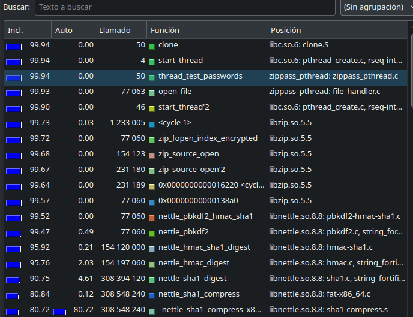
  
- En el siguiente código callgrind muestra la cantidad de veces que se llamó a ```open file()```: (77063) llamadas para el caso de prueba ```input001.txt``` . También, de manera similar, sucede la misma situación con los accessos a variables protegidas por mutex

     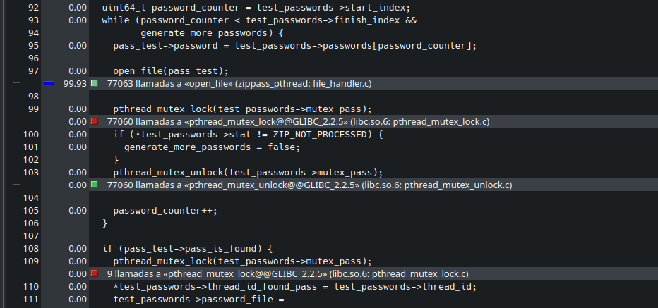

- Como solución se implementó un cambio importate: en lugar de abrir el zip por cada contraseña y tratar de descrifrar el archivo txt interno, abrir una sola vez el archivo zip, y probar las contraseñas hasta descifrar la contraseña del archivo txt interno debería ser más eficiente.

     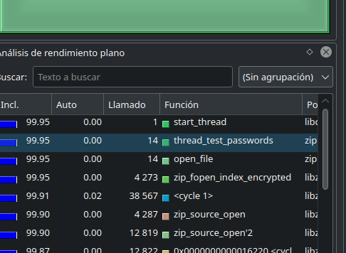

 - La solución pensada logró reducir en los dos casos de prueba los llamados a `open_file()`, además, se redujo los accesos a variables protegidas por mutex
  
     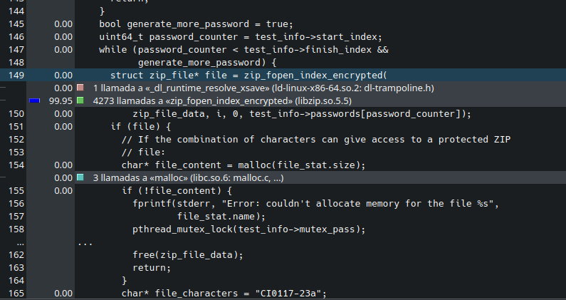

- Es importante destacar en este caso, que se usó la formula para calcular speedup y eficiencia cuando se compara la versión serial y la de multiples hilos. Por lo cual, la eficiencia, realmente no es correcta.Ya que debe ser entre 0 y 1, en este caso, para ambas optimizaciónes se usaron los mismas cantidades de hilos.

- Aunque se tenga igualmente que probar cada contraseña, al menos se optimizó ligeramente al reducir la cantidad de aperturas del archivo zip, en la optimización se abre el archivo zip una sola vez por cada hilo que prueba contraseñas.Sein embargo, el mayor tiempo se dedica a llamar al metodo `zip_fopen_encrypted()`, el cual prueba cada contraseña, pero no es posible realizar algún cambio para probar la contraseña, ya que se usa fuerza bruta.

- En el siguiente cuadro se compara los incrementos de velocidad y eficiencia
  
     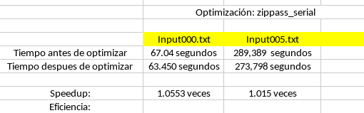

- Aunque se presentó una optimización, no se puede considerar una optimización realmente notoria. Sin embargo, según los datos dados por callgrind y mostrados anteriormente, el mayor tiempo de ejecución sucede al probar las contraseñas, por lo cual, al ser un algoritmo de fuerza bruta, no se consideró hacer más optimizaciones
  
#### Optimización zippass_pthread
- Esta optimización se basa en la optimizacion de zippass_serial, por lo cual, realmente las mejoras son dadas por el uso de concurrencia, pero en sí los cambios son los mismos. Además se conservó el mapeo estático por bloques

-    Al realizar las pruebas usando callgrind se detectó que el programa abría los archivos zip en multiples ocaciones para probar cada contraseña, esto sucede en el metodo ```open_file()```, este metodo es invocado desde otro metodo ```thread_test_password()```

     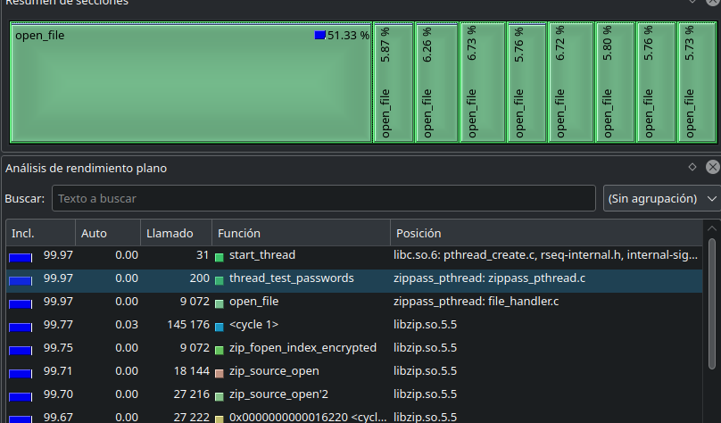
  
- En el siguiente código callgrind muestra la cantidad de veces que se llamó a ```open file()```: (9072) llamadas para el caso de prueba ```input001.txt``` . También, de manera similar, sucede la misma situación con los accessos a variables protegidas por mutex.

     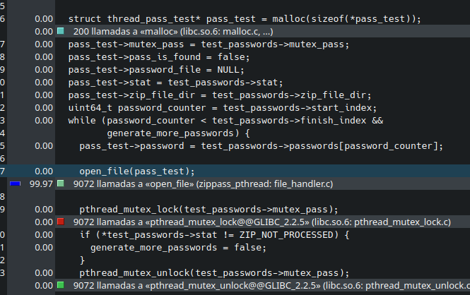

- Como solución se implementó un cambio: abrir una sola vez el archivo zip, y probar las contraseñas hasta descifrar la contraseña del archivo txt interno

     


- La solución pensada logró reducir en los dos casos de prueba los llamados a `open_file()`, además, se redujo los accesos a variables protegidas por mutex
 
     

- En el siguiente cuadro se compara los incrementos de velocidad. Se usó la formula para calcular speedup y eficiencia usando la versión optmizada de la serial, por tener menor tiempo de ejecución.
     
     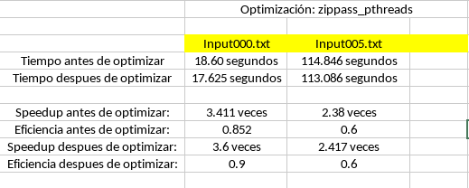
     
- Se puede notar que la versión concurrente es bastante positiva en rendimiento comparada a la serial. Sin embargo, se puede notar que apenas hay diferencia entre la versión optimizada y la que no. Esto puede deberse a que las optimizaciones no son tan necesarias, y como se mostró anteriormente usando la herramienta callgrind, el mayor tiempo se dedica a llamar al metodo `zip_fopen_encrypted()`, el cual prueba cada contraseña pero no es posible realizar algún cambio para probar la contraseña, ya que se usa fuerza bruta.
  

#### Optimización zippass_dynamic

-    Para la optimización de zippass_dynamic se dió uso de la optimización zippass_pthread_optimized, esto porque mostró mejoría en los tiempos de ejecución, por lo cual, lo que se cambió fue el mapeo: se cambió mapeo estático por bloques a un mapeo dinámico 
  
- En esta versión de optimización igualmente abre un solo archivo zip por thread, sin embargo, el programa lleva un contador de contraseñas protegido por un mutex; El contador es un puntero el cual todos los threads tienen acceso, por lo cual, cada hilo va tomando una contraseña según el valor del contador al momento de solicitar una posición del arreglo de contraseñas, para posteriormente ser usado para abrir el archivo txt dentro del archivo zip.

- Este contador al ser compartido entre los threads, garantiza que todos los hilos sepan que contraseñas ya han sido analizadas, y como ventaja, un hilo que esté disponible puede analizar todas las contraseñas si los demás hilos están ocupados, lo que se implementó, es una simulación de una cola.
  
- En el siguiente cuadro se compara los incrementos de velocidad. Se usó la formula para calcular speedup y eficiencia usando la versión optmizada de la serial, por tener menor tiempo de ejecución.
  
  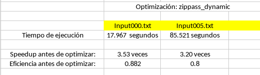
  
- En esta optimización se encontró una positiva mejoría en los tiempos de ejecución, sobre todo en los casos de prueba más grandes.
  
- Las razones pueden ser diferentes, hay que destacar que se parte de una versión ya optimizada en la optimización: `zippass_pthread_optimized`, por lo cual algunos segundos de mejora se deben a usar la versión optimizada.
  
- La mejora se puede dar por la posilidad que un hilo que esté desocupado realize las tareas del programa cuando los otros hilos están ocupados
    

  
#### Comparación de optimizaciónes
- En el siguiente cuadro se compara los incrementos de velocidad según las diferentes optimizaciones realizadas anteriormente: 

  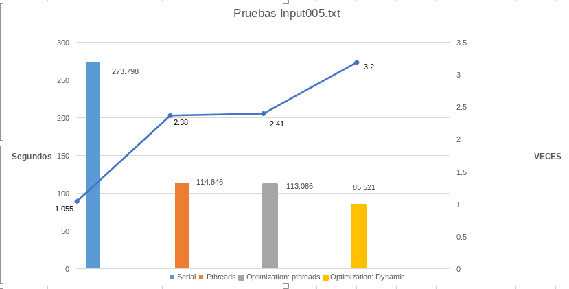

- En estos casos, se muestra que la diferencia entre la versión no optimizada de pthreads y la que si no es grande, aún así se puede notar que la mejor optimización fue la de mapeo dinámico, porque, en casos de pruebas grandes tuvo mejor tiempos de ejecución

  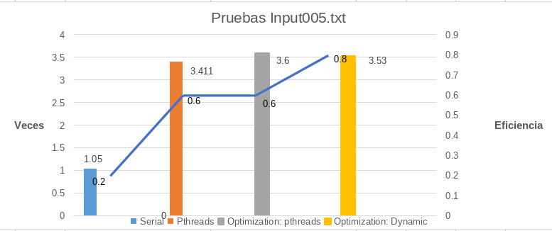


- Se puede observar que la versión optimizada de pthreads es la que presenta mejor relación velocidad/eficiencia.

 -  Como comentario, aunque no se guardaron las implementaciones ni los test, se implementó inicialmente el mapeo dinamico usando la versión no optimizada de zippass_pthread, la cual, como se indicó anteriomente: <em>"cada contraseña a probar tenía que abrir todo el archivo zip antes de intentar desencriptar la contraseña"</em>; en esa versión se tenían peores resultados que la versión no optimizada usando mapeo estático por bloques.

- Es interesante destacar que para casos de pruebas pequeños como el de `input000.txt` los tiempos de ejecución no parecen ser más positivos con el uso de mapeo dinámico, pero sí en los más grandes.
 
- La razón por la cual el mapeo dinámico puede ser más eficiente en casos de pruebas grandes, es que al haber contraseñas más largas, los hilos se reparten muchas más contraseñas, y como el sistema operativo debe usar los hilos para otras tareas, algunos hilos pueden terminar antes que otros, ´los cuales tendrán que esperar a los demás sin poder ayudar en el procesamiento de contraseña. Por eso el tener todas las contraseñas disponibles para todos los hilos, cualquier hilo que esté desocupado podría realizar las tareas necesarias si los demás hilos están ocupados, mejorando así los tiempos de ejecución

- Por lo cual, la versión de mapeo dinámico es la mejor versión para ser usada en un contexto real, ya que presenta mejores tiempo de ejecución.

#### Comparación de grados de concurrencia
- En el siguiente cuadro se observa como decrece la rapidez del descrifrado de archivos zip al usar más nucleos que los incorporados en el CPU (4).

  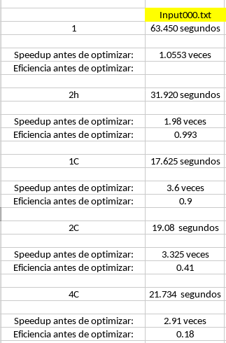

 - A partir de los 4 nucleos no se observa mejoría, aunque no afecta drásticamente el tiempo de ejecución del programa, si indica que no es conveniente usar más de 4 hilos para procesar los archivos

  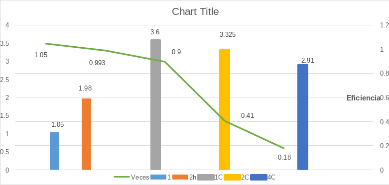

- En esta imagen se muestra que entre más hilos más ineficiente es el programa, por lo cual con 4 hilos es lo máximo que se recomendaría usar en la computadora usada.
- Posiblemente el programa se vuelve más ineficiente por bloque de variables, por mutex, control del sistema operativo entre otras.
  
#### Análisis de resultados

- Se puede concluir que la implementación del programa usando mapeo dinámico y no más de 4 hilos es la opción más eficiente